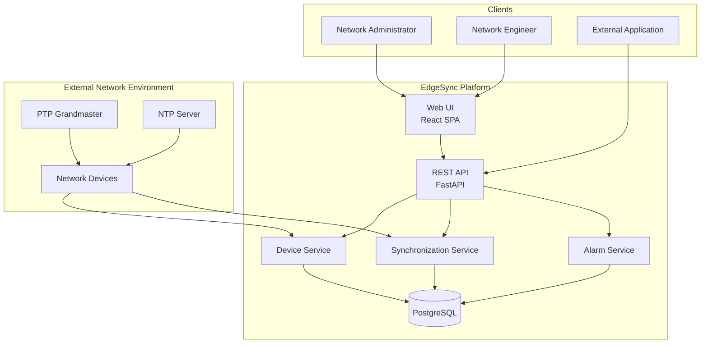
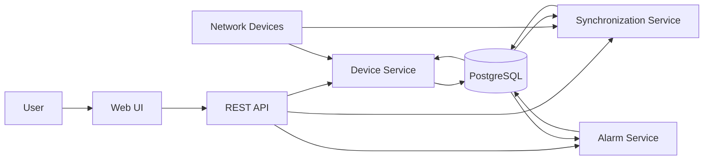
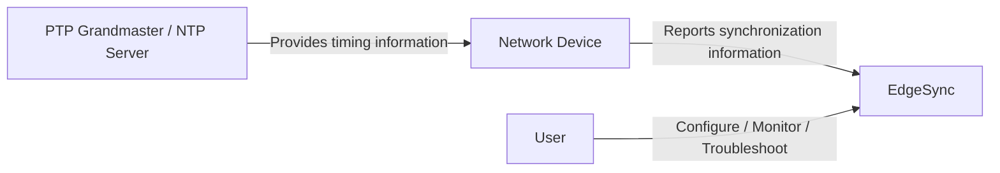

# EdgeSync Architecture

This document describes the high-level architecture of EdgeSync and the relationship between its main components and the external network environment.

EdgeSync is a network synchronization monitoring and management platform. It helps network administrators and engineers monitor synchronization sources, configure PTP/NTP settings, investigate synchronization issues, and manage network alarms.

## Scope

This document focuses on the logical architecture of EdgeSync, including:

- major architecture layers
- main software components
- responsibility boundaries
- high-level data flow
- relationship between EdgeSync and the external network environment

Detailed protocol behavior, API definitions, database schemas, and device-specific implementation are outside the scope of this document.

---

## Architecture Overview

EdgeSync uses a layered web-based architecture. Users interact with the platform through the Web UI or REST API. The backend separates device management, synchronization management, and alarm management into dedicated services.

The architecture separates the EdgeSync platform from the external network environment. Network devices perform the underlying synchronization behavior, while EdgeSync collects and manages the resulting device and synchronization information.

---

## Architecture Layers

### Client Layer

The Client Layer provides access to EdgeSync.

It includes:

- Web UI for network administrators and network engineers
- External applications that access the REST API

The Web UI is implemented as a React-based single-page application (SPA).

### API Layer

The API Layer provides programmatic access to EdgeSync resources.

The REST API is implemented using FastAPI and provides a consistent interface for the Web UI and external applications.

### Service Layer

The Service Layer contains the main application services:

- Device Service
- Synchronization Service
- Alarm Service

Each service owns a specific area of EdgeSync functionality.

### Data Layer

The Data Layer uses PostgreSQL to store EdgeSync application data, such as:

- network devices
- synchronization sources
- synchronization monitoring information
- alarms
- users
- configuration

The detailed database schema is outside the scope of this document.

### External Network Environment

The External Network Environment contains the network devices and synchronization infrastructure monitored by EdgeSync.

Examples include:

- gNB
- Router
- PTP-capable network device
- Timing device
- PTP Grandmaster
- NTP Server

The external network environment performs the underlying synchronization mechanisms. EdgeSync monitors and manages information associated with that environment.

---

## Main Components

| Component | Responsibility |
|---|---|
| **Web UI** | Provides the user interface for administrators and engineers. |
| **REST API** | Provides programmatic access to EdgeSync resources and operations. |
| **Device Service** | Manages network device information and device-related operations. |
| **Synchronization Service** | Manages synchronization sources and synchronization monitoring information. |
| **Alarm Service** | Manages the lifecycle of monitoring alarms. |
| **PostgreSQL** | Stores EdgeSync application data. |
| **Network Devices** | Perform underlying device and synchronization functions and provide information monitored by EdgeSync. |

---

## Responsibility Boundaries

| Component | Owns | Does not define |
|---|---|---|
| Web UI | User interaction and presentation | Underlying synchronization protocol behavior |
| REST API | API access to EdgeSync resources | Device-specific synchronization behavior |
| Device Service | Device management | Synchronization protocol implementation |
| Synchronization Service | Synchronization monitoring and source management | The device's underlying synchronization mechanism |
| Alarm Service | Alarm lifecycle management | The root cause of every synchronization problem |
| PostgreSQL | Application data storage | Synchronization behavior |
| Network Device | Underlying device and synchronization behavior | EdgeSync's monitoring model |

These boundaries help keep the product architecture and documentation model clear.

---

## Data Flow

The following diagram shows the simplified flow of information through EdgeSync.

At a high level:

1. A user interacts with EdgeSync through the Web UI, or an external application accesses the REST API.
2. The API routes requests to the appropriate application service.
3. Device and synchronization services collect or manage information associated with network devices.
4. Application services store and retrieve EdgeSync data in PostgreSQL.
5. The Web UI presents the resulting information to users.

---

## Synchronization Architecture

EdgeSync does not replace the synchronization mechanisms implemented by network devices.

In this model:

- A **PTP Grandmaster** provides reference timing within a PTP environment.
- An **NTP Server** provides time synchronization information using NTP.
- A **Network Device** performs the underlying synchronization behavior.
- **EdgeSync** monitors and manages synchronization information.
- The **User** uses EdgeSync to configure, monitor, and troubleshoot the environment.

A GNSS Reference may provide timing within the broader synchronization infrastructure, but it is modeled separately from the network synchronization source types.

---

## Architecture Boundaries

| Topic | In Scope | Out of Scope |
|---|---|---|
| Product architecture | Logical components and relationships | Detailed deployment topology |
| Web UI | Role in the architecture | Detailed UI design |
| REST API | Role as the API layer | Complete API definitions |
| Services | High-level responsibilities | Internal implementation details |
| Database | Role as application data storage | Complete database schema |
| Network environment | Relationship with EdgeSync | Device-specific implementation |
| PTP/NTP | High-level architectural relationship | Detailed protocol behavior |
| Synchronization monitoring | High-level monitoring role | Detailed monitoring model |
| Alarms | High-level alarm service role | Detailed alarm lifecycle rules |

---

## Related Documentation

For detailed information, see:

- [Network Synchronization](network-synchronization.md)
- [Synchronization States](synchronization-states.md)
- [Synchronization Sources](synchronization-sources.md)
- [PTP](ptp.md)
- [NTP](ntp.md)
- [Monitoring Model](monitoring-model.md)

Developer documentation and API definitions are maintained separately in the Developer Guide and API Reference.

---

## Key Takeaways

- EdgeSync is a web-based synchronization monitoring and management platform.
- The Web UI and external applications access EdgeSync through the REST API.
- The backend separates device management, synchronization management, and alarm management into dedicated services.
- PostgreSQL stores EdgeSync application data.
- Network devices perform the underlying synchronization mechanisms, while EdgeSync monitors and manages the resulting information.
- PTP Grandmasters and NTP Servers are the primary network synchronization source types in the EdgeSync model.
