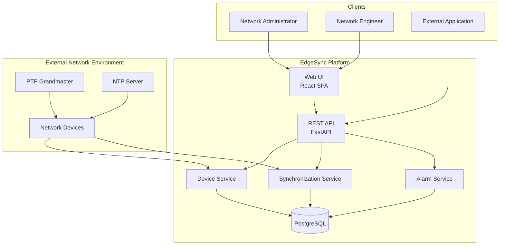
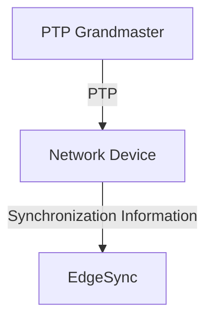
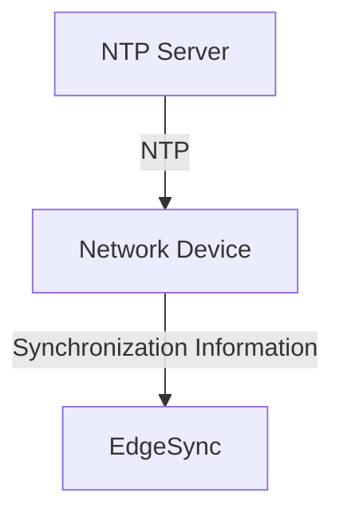
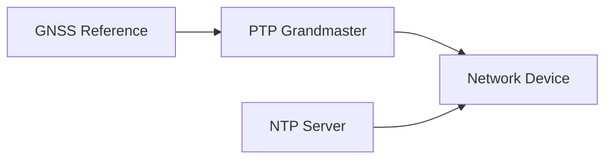
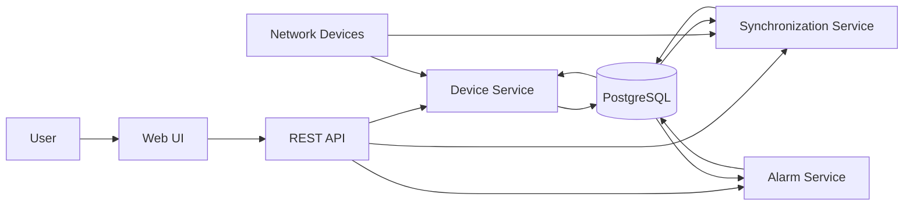
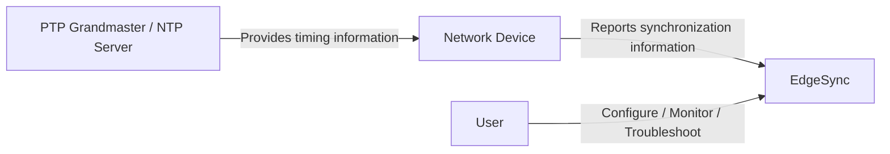

# EdgeSync Architecture

This document describes the high-level architecture of EdgeSync and the relationship between its main components.

EdgeSync is a network synchronization monitoring and management platform. It provides a web interface and REST API for managing devices,monitoring synchronization, and managing alarms.

This document focuses on the logical architecture and component responsibilities. It does not describe the detailed implementation of PTP, NTP, or individual API operations.

---

## Architecture Overview

EdgeSync uses a web-based architecture with a REST API and services that manage devices, synchronization information, and alarms.

The architecture separates the user interface, API layer, application services, data storage, and monitored network environment.

---

## Main Components

| Component               | Responsibility                                                        | Primary Interface                     |
| ----------------------- | --------------------------------------------------------------------- | ------------------------------------- |
| Web UI                  | Provides the user interface for managing and monitoring EdgeSync.     | REST API                              |
| REST API                | Provides programmatic access to EdgeSync resources and operations.    | HTTP/REST                             |
| Device Service          | Manages network device information and device-related operations.     | REST API / internal services          |
| Synchronization Service | Manages synchronization sources and synchronization monitoring data.  | REST API / internal services          |
| Alarm Service           | Manages alarms and their lifecycle.                                   | REST API / internal services          |
| PostgreSQL              | Stores EdgeSync application data.                                     | Application services                  |
| Network Devices         | Provide device and synchronization information monitored by EdgeSync. | Network protocols / device interfaces |

---

## Web UI

The Web UI provides the primary interface for network administrators and network engineers to manage and monitor EdgeSync.

The Web UI is implemented as a React-based single-page application (SPA) and communicates with the backend through the REST API.

The Web UI provides access to functions such as:

- Dashboard
- Device management
- Synchronization monitoring
- Synchronization source configuration
- Alarm management
- Administration

For detailed user workflows, see the Administrator Guide.

---

## REST API

The REST API provides programmatic access to EdgeSync resources.

The API is implemented using FastAPI and exposes resources for:

- Devices
- Synchronization
- Synchronization Sources
- Alarms

The Web UI also uses the REST API to communicate with backend services.

See the Developer Guide and API Reference for details about API operations.

---

## Device Service

The Device Service manages network device information.

Typical responsibilities include:

- Registering devices
- Retrieving device information
- Updating device configuration
- Removing devices
- Reporting device status

The Device Service provides the device-related functionality used by the Web UI and REST API.

The Device Service does not implement the underlying synchronization protocol used by a network device.

---

## Synchronization Service

The Synchronization Service manages synchronization-related information and synchronization source configuration.

Typical responsibilities include:

- Managing synchronization sources
- Monitoring synchronization information
- Reporting Synchronization State
- Providing synchronization metrics
- Identifying the Active Synchronization Source

The Synchronization Service represents synchronization information reported by monitored network devices. It does not replace the underlying synchronization mechanism implemented by those devices.

---

## Alarm Service

The Alarm Service manages alarms generated from monitored conditions.

Typical responsibilities include:

- Creating alarms
- Retrieving active alarms
- Retrieving alarm history
- Acknowledging alarms
- Clearing alarms

The Alarm Service manages the alarm lifecycle but does not determine the root cause of every synchronization problem.

---

## PostgreSQL

PostgreSQL stores EdgeSync application data.

The database may contain information related to:

- Network devices
- Synchronization sources
- Synchronization monitoring data
- Alarms
- Users
- Configuration

The exact database schema is outside the scope of this architecture document.

---

## Network Devices

Network devices are the systems whose synchronization information is monitored by EdgeSync.

Examples in the EdgeSync model include:

- gNB
- Router
- PTP-capable network device
- Timing device

The monitored device may use different synchronization mechanisms depending on its configuration.

For example:

Or:

EdgeSync monitors the synchronization condition reported by the network device.

---

## Synchronization Sources

A Synchronization Source is a source that a network device uses as a reference for synchronization.

In EdgeSync, the primary network synchronization source types are:

- PTP Grandmaster
- NTP Server

A GNSS Reference is modeled as a timing reference within the synchronization infrastructure rather than as a network synchronization source.

The relationship can be represented as:

For detailed source configuration and source selection behavior, see [Synchronization Sources](synchronization-sources.md).

---

## Synchronization Monitoring

EdgeSync separates the underlying synchronization mechanism from its monitoring model.

Network devices perform synchronization using their configured mechanism, such as PTP or NTP. EdgeSync monitors the synchronization information reported by those devices.

The monitoring model includes:

- Synchronization State
- Active Synchronization Source
- Synchronization Metrics
- Last Update Time
- Alarms

See [Monitoring Model](monitoring-model.md) for details.

---

## Synchronization State

EdgeSync uses a common Synchronization State model to represent the synchronization condition of a monitored network device.

The supported states are:

- `LOCKED`
- `HOLDOVER`
- `FREERUN`
- `FAILED`

These states describe the synchronization condition rather than the root cause of a problem.

See [Synchronization States](synchronization-states.md) for definitions and state-specific behavior.

---

## Source Status and Synchronization State

EdgeSync distinguishes source availability from device synchronization condition.

See [Monitoring Model](monitoring-model.md) for details.

---

## Data Flow

The following simplified flow shows how information moves through EdgeSync:

---

## Responsibility Boundaries

The following table summarizes the primary responsibility boundaries.

| Component               | Owns                       | Does not own               |
| ----------------------- | -------------------------- | -------------------------- |
| Device Service          | Device management          | Synchronization protocol   |
| Synchronization Service | Synchronization monitoring | Underlying synchronization |
| Alarm Service           | Alarm lifecycle            | Root-cause diagnosis       |
| Network Device          | Synchronization behavior   | EdgeSync monitoring model  |

---

## Synchronization Architecture

The synchronization source provides timing information to the network device.

The network device performs the underlying synchronization.

EdgeSync monitors and manages the resulting synchronization information.

---

# Architecture Boundaries

This document focuses on the logical architecture of EdgeSync.

| In scope                   | Out of scope                           |
| -------------------------- | -------------------------------------- |
| Logical architecture       | Detailed PTP protocol behavior         |
| Component responsibilities | Detailed NTP protocol behavior         |
| Component relationships    | Device-specific implementation         |
| High-level data flow       | Database schema                        |
| EdgeSync/network boundary  | Authentication implementation          |
| Monitoring architecture    | Performance/scalability specifications |

---

## Related Documentation

- [Network Synchronization](network-synchronization.md)
- [Synchronization States](synchronization-states.md)
- [Synchronization Sources](synchronization-sources.md)
- [PTP](ptp.md)
- [NTP](ntp.md)
- [Monitoring Model](monitoring-model.md)
- [Developer Guide](../developer/api-overview.md)

---

## Key Takeaways

- EdgeSync is a synchronization monitoring and management platform.
- The Web UI communicates with backend services through the REST API.
- Device, synchronization, and alarm functions are separated into dedicated services.
- PostgreSQL stores EdgeSync application data.
- Network devices perform the underlying synchronization, while EdgeSync monitors the resulting information.
- PTP Grandmasters and NTP Servers are the primary network synchronization source types in the EdgeSync model.
