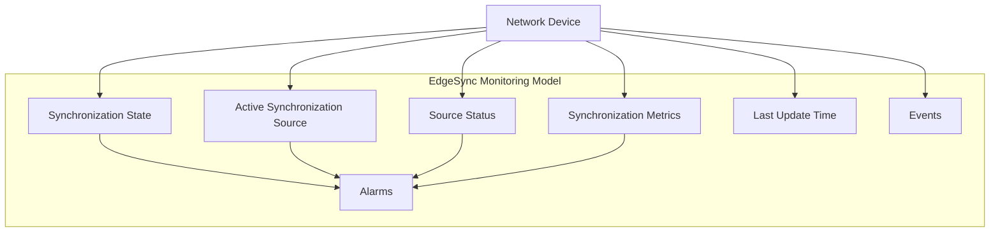
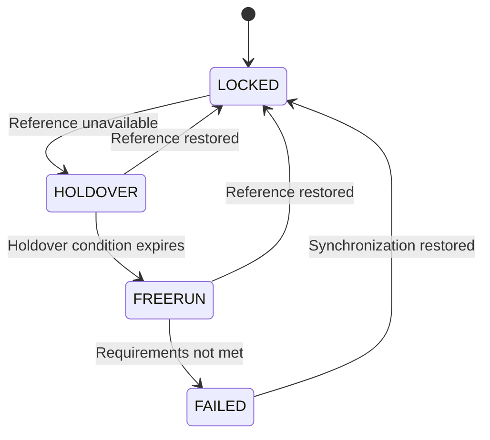
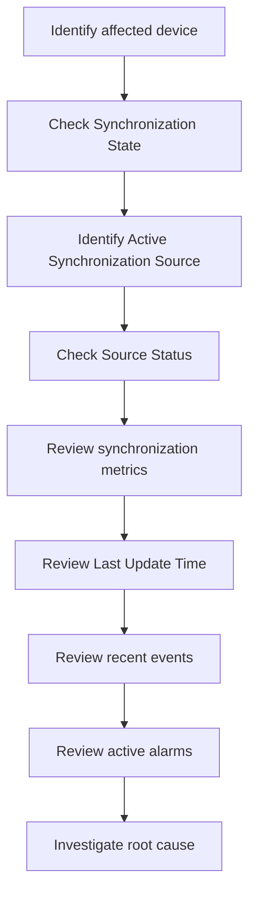
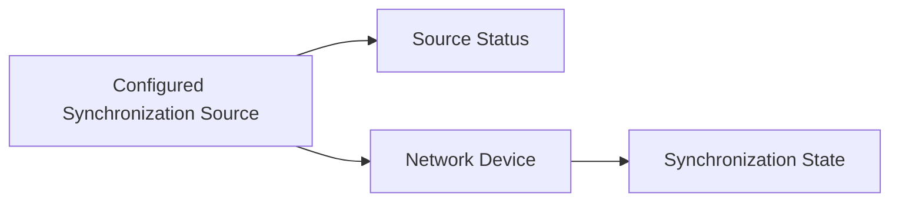

# EdgeSync Monitoring Model

This document defines the common monitoring model used by EdgeSync to represent the synchronization condition of monitored network devices.

The model provides a consistent way to interpret synchronization state, synchronization source information, synchronization metrics, events, and alarms across different synchronization mechanisms such as PTP and NTP.

---

## 1. Purpose

EdgeSync monitors synchronization information reported by supported network devices.

The monitoring model separates:

- the underlying synchronization mechanism
- the current synchronization condition
- the synchronization source
- measured synchronization metrics
- source availability
- events
- alarms

This separation allows users to evaluate synchronization conditions without treating a single metric, state, or alarm as the complete explanation of a problem.

The model is intended to support:

- dashboard and monitoring views
- device synchronization status
- synchronization source monitoring
- alarm generation and investigation
- troubleshooting workflows
- REST API representations

---

## 2. Scope

This document defines the common EdgeSync monitoring concepts and their relationships.

It covers:

- Monitoring Model Overview
- Synchronization Information
- Synchronization State
- Active Synchronization Source
- Source Status
- Synchronization Metrics
- Last Update Time
- Events and Alarms
- Interpreting Monitoring Data
- Monitoring Data Relationships
- API Representation
- Monitoring Boundaries

Detailed PTP and NTP protocol behavior is defined in the corresponding protocol documents.

Detailed alarm lifecycle behavior belongs in the alarm documentation and API Reference.

---

## 3. Monitoring Model Overview

EdgeSync receives or collects synchronization information associated with monitored network devices and represents that information using a common monitoring model.



The model should be interpreted as a set of related observations rather than as independent values.

For example, an engineer investigating a synchronization problem should normally review:

1. Synchronization State
2. Active Synchronization Source
3. Source Status
4. Synchronization Metrics
5. Last Update Time
6. Recent Events
7. Active Alarms

---

## 4. Synchronization Information

A synchronization status record represents the current synchronization information available for a monitored device.

A typical record contains:

| Field | Description |
|---|---|
| `deviceId` | Identifier of the monitored network device. |
| `state` | Current EdgeSync Synchronization State. |
| `source` | Current Active Synchronization Source. |
| `offsetNs` | Measured clock offset in nanoseconds. |
| `frequencyOffsetPpb` | Measured frequency offset in parts per billion. |
| `jitterNs` | Measured timing variation in nanoseconds. |
| `lastUpdated` | Time when the synchronization information was most recently updated. |

Not every monitored device or synchronization mechanism necessarily provides every metric.

The exact information available depends on the device implementation and the supported monitoring interface.

---

## 5. Synchronization State

Synchronization State describes the current synchronization condition of a monitored network device.

EdgeSync defines four canonical synchronization states:

| State | Description | Typical condition |
|---|---|---|
| `LOCKED` | The device is synchronized to an available reference source. | Synchronization is operating normally. |
| `HOLDOVER` | The device has temporarily lost its reference source but is maintaining timing using its local clock. | The reference source is unavailable or communication with the source is interrupted. |
| `FREERUN` | The device is operating without an active external synchronization reference. | No usable synchronization reference is currently available. |
| `FAILED` | EdgeSync determines that the device is no longer meeting configured synchronization requirements. | Synchronization has degraded beyond the configured requirements. |

These are EdgeSync monitoring states. They do not necessarily represent every synchronization state reported by an underlying network device.

### State Interpretation

A Synchronization State describes what is happening, but does not necessarily explain why it is happening.

For example:

```text
State: HOLDOVER

Possible causes:
- Synchronization source unavailable
- Network connectivity problem
- PTP or NTP configuration problem
- Timing source failure
```

Therefore, state information should be interpreted together with source information, metrics, events, alarms, and device configuration.

### Simplified State Model



This is a simplified monitoring model. Actual transitions may depend on device behavior, source availability, configured thresholds, and deployment-specific requirements.

---

## 6. Active Synchronization Source

The Active Synchronization Source is the synchronization source currently selected or used by the monitored network device.

Examples include:

- PTP Grandmaster
- NTP Server

For example:

```text
Synchronization State: LOCKED
Active Synchronization Source: ptp-gm-01
```

In the EdgeSync API, the `source` field represents the Active Synchronization Source.

If no active synchronization source is available, `source` is represented as `null`.

Example:

```json
{
  "deviceId": "edge-001",
  "state": "FREERUN",
  "source": null
}
```

### Active Source vs. Configured Sources

A device may have multiple configured synchronization sources.

For example:

```text
Configured Sources
├── ptp-gm-01
├── ptp-gm-02
└── ntp-01

Active Synchronization Source
└── ptp-gm-01
```

Primary and Secondary Sources describe source priority or configuration. They do not describe PTP or NTP protocol roles.

The exact source-selection behavior depends on the monitored device and its configuration.

---

## 7. Source Status

Source Status describes whether a configured synchronization source can currently be used.

EdgeSync uses the following source statuses:

| Status | Description |
|---|---|
| `AVAILABLE` | The source is available for synchronization. |
| `UNAVAILABLE` | The source cannot currently be used. |
| `UNKNOWN` | EdgeSync cannot determine the current source status. |

Source Status and Synchronization State describe different aspects of the monitored environment.

For example:

```text
Source Status: AVAILABLE
Synchronization State: HOLDOVER
```

These values are not necessarily contradictory.

An available source does not necessarily mean that the device is currently synchronized to that source.

---

## 8. Synchronization Metrics

Synchronization metrics provide quantitative information about synchronization quality and behavior.

The core EdgeSync metrics are:

- Offset
- Frequency Offset
- Jitter
- Last Update Time

### 8.1 Offset

Offset represents the estimated time difference between the device clock and its synchronization reference.

The EdgeSync API represents offset using:

```text
offsetNs
```

The unit is nanoseconds (`ns`).

Example:

```json
{
  "offsetNs": 35
}
```

A smaller offset generally indicates that the device clock is closer to its synchronization reference.

However, an acceptable offset depends on the device, network, application, and configured synchronization requirements. No universal threshold should be assumed.

### 8.2 Frequency Offset

Frequency Offset represents the difference between the rate of the local clock and the synchronization reference.

The EdgeSync API represents frequency offset using:

```text
frequencyOffsetPpb
```

The unit is parts per billion (`ppb`).

Example:

```json
{
  "frequencyOffsetPpb": 0.8
}
```

Frequency Offset can help engineers identify sustained differences in local clock rate.

### 8.3 Jitter

Jitter represents variation in synchronization timing measurements over time.

The EdgeSync API represents jitter using:

```text
jitterNs
```

The unit is nanoseconds (`ns`).

Example:

```json
{
  "jitterNs": 12
}
```

Jitter should be interpreted together with other synchronization metrics rather than as an isolated indicator.

The exact meaning and calculation of jitter may depend on the device implementation and monitoring model.

### 8.4 Last Update Time

Last Update Time indicates when the synchronization information was most recently updated.

The EdgeSync API represents this value using:

```text
lastUpdated
```

Example:

```json
{
  "lastUpdated": "2026-09-08T08:30:00Z"
}
```

A stale Last Update Time may indicate that current synchronization information is no longer being reported.

---

## 9. Events

An event records a notable occurrence detected or reported by the monitoring system.

Examples may include:

- synchronization source loss
- synchronization source recovery
- synchronization state change
- device synchronization degradation

Events provide historical context for interpreting the current monitoring state.

An event is not the same as an alarm.

---

## 10. Alarms

An alarm represents a monitored condition that requires attention.

An alarm may be generated when a monitored condition meets a configured alarm rule.

Examples include:

- Synchronization Source Unavailable
- High PTP Offset
- Synchronization Lost
- Synchronization Failure

An alarm should not be treated as a synonym for a Synchronization State or an Event.

For example:

```text
Synchronization State: HOLDOVER
Alarm: Synchronization Source Unavailable
```

The state describes the current synchronization condition.

The alarm identifies a condition that requires attention.

The underlying root cause may require further investigation.

---

## 11. State, Source, Metrics, Events, and Alarms

The monitoring model is most useful when these concepts are interpreted together.

| Information | Main question it answers |
|---|---|
| Synchronization State | What is the current synchronization condition? |
| Active Synchronization Source | Which source is currently being used? |
| Source Status | Can a configured source currently be used? |
| Offset | How far is the device clock from its reference? |
| Frequency Offset | How does the local clock rate differ from the reference? |
| Jitter | How much variation exists in timing measurements? |
| Last Update Time | How recent is the reported information? |
| Event | What notable occurrence happened? |
| Alarm | What condition currently requires attention? |

No single value should normally be used to determine the root cause of a synchronization problem.

---

## 12. Interpreting Monitoring Data

A typical investigation can follow this sequence:



### Example: Normal Synchronization

```json
{
  "deviceId": "edge-001",
  "state": "LOCKED",
  "source": "ptp-gm-01",
  "offsetNs": 35,
  "frequencyOffsetPpb": 0.8,
  "jitterNs": 12,
  "lastUpdated": "2026-09-08T08:30:00Z"
}
```

This indicates that the device is currently synchronized to `ptp-gm-01` and reports the listed synchronization metrics.

The example does not by itself establish whether every metric meets operational requirements. Those requirements depend on configured synchronization requirements and thresholds.

### Example: Degraded Synchronization

```text
Synchronization State: HOLDOVER
Active Synchronization Source: null
Source Status: UNAVAILABLE

Possible investigation:
1. Check source availability.
2. Review recent source-loss events.
3. Review active alarms.
4. Check synchronization metrics.
5. Verify the network path.
6. Check device configuration.
```

The state alone does not identify the root cause.

---

## 13. Relationship Between Source Status and Synchronization State

Source Status and Synchronization State should remain separate concepts.

The relationship can be summarized as:



Source Status describes source availability.

Synchronization State describes the device's resulting synchronization condition.

An `AVAILABLE` source can coexist with a degraded synchronization state, depending on the device's current synchronization condition and configuration.

---

## 14. Monitoring Data and API Representation

The monitoring model is exposed through the EdgeSync REST API.

A synchronization status response may look like:

```json
{
  "deviceId": "edge-001",
  "state": "LOCKED",
  "source": "ptp-gm-01",
  "offsetNs": 35,
  "frequencyOffsetPpb": 0.8,
  "jitterNs": 12,
  "lastUpdated": "2026-09-08T08:30:00Z"
}
```

### API Field Mapping

| Monitoring Concept | API Field | Example |
|---|---|---|
| Monitored device | `deviceId` | `edge-001` |
| Synchronization State | `state` | `LOCKED` |
| Active Synchronization Source | `source` | `ptp-gm-01` |
| Offset | `offsetNs` | `35` |
| Frequency Offset | `frequencyOffsetPpb` | `0.8` |
| Jitter | `jitterNs` | `12` |
| Last Update Time | `lastUpdated` | `2026-09-08T08:30:00Z` |

These field names are part of the EdgeSync monitoring model and should remain consistent across the Developer Guide and API Reference.

---

## 15. Monitoring Boundaries

The Monitoring Model defines how EdgeSync represents synchronization information. It does not define every detail of the underlying synchronization mechanisms.

### In Scope

- Common synchronization monitoring concepts
- EdgeSync synchronization states
- Active synchronization source
- Source status
- Synchronization metrics
- Events
- Alarms at the conceptual level
- API representation of synchronization status
- Relationships among monitoring concepts

### Out of Scope

- Detailed PTP message exchange
- Detailed NTP protocol behavior
- Device-specific clock algorithms
- Universal synchronization thresholds
- Complete alarm lifecycle rules
- Complete REST API endpoint definitions
- Database schema
- Device-specific implementation details

See the PTP, NTP, Synchronization States, Synchronization Sources, and API documentation for details.

---

## 16. Related Documentation

- [Network Synchronization](network-synchronization.md)
- [Synchronization States](synchronization-states.md)
- [Synchronization Sources](synchronization-sources.md)
- [PTP](ptp.md)
- [NTP](ntp.md)
- [Troubleshooting](../troubleshooting/index.md)
- [EdgeSync Terminology](../reference/terminology.md)

---

## 17. Key Takeaways

- EdgeSync uses a common monitoring model to represent synchronization information across supported synchronization mechanisms.
- Synchronization State describes the current synchronization condition of a monitored device.
- Active Synchronization Source identifies the source currently used by the device.
- Source Status describes whether a configured synchronization source can currently be used.
- Offset, Frequency Offset, Jitter, and Last Update Time provide quantitative and temporal context.
- Events and alarms provide additional context for understanding synchronization problems.
- No single monitoring value should normally be used to determine root cause.
- The monitoring model separates EdgeSync's monitoring representation from the underlying PTP or NTP synchronization mechanism.
