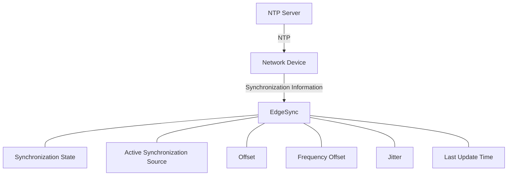
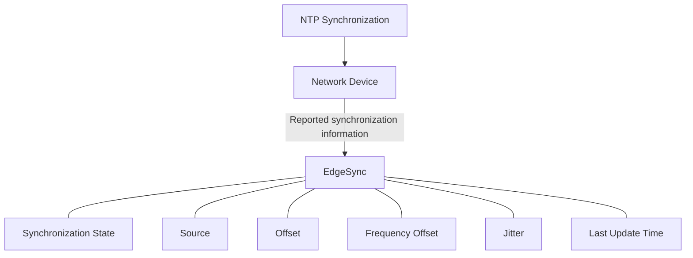
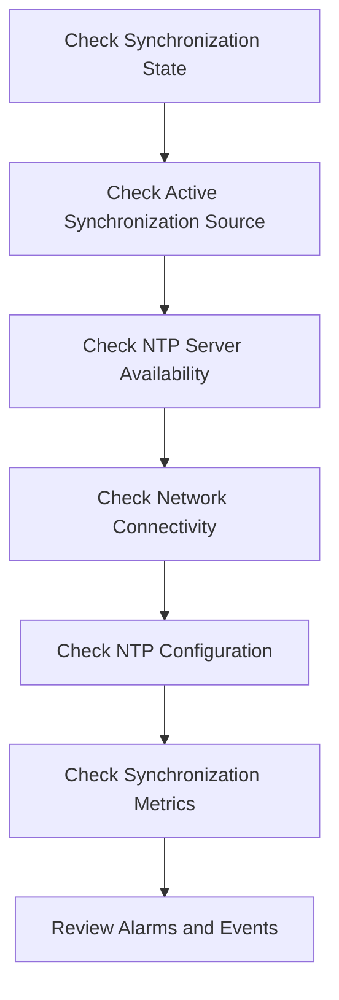

# Network Time Protocol (NTP)

Network Time Protocol (NTP) is a protocol used to synchronize the clocks of network devices with an NTP Server.

In EdgeSync, an NTP Server can be configured as a **Synchronization Source** for a monitored network device. EdgeSync monitors synchronization information reported by the device and uses that information to represent the device's synchronization condition.

---

## NTP in EdgeSync

NTP provides time synchronization information to network devices over an IP network.

The basic relationship is:



In this model:

- The **NTP Server** provides synchronization information.
- The **Network Device** uses the NTP Server as a synchronization reference.
- **EdgeSync** monitors synchronization information reported by the device.
- EdgeSync does not act as the NTP Server.

---

## NTP Server

An **NTP Server** provides time synchronization information to network devices using NTP.

In EdgeSync, an NTP Server can be configured as a **Synchronization Source**.

A configured NTP Server may have one of the following source statuses:

| Source Status | Meaning |
|---|---|
| `AVAILABLE` | The NTP Server is available for synchronization. |
| `UNAVAILABLE` | The NTP Server cannot currently be used. |
| `UNKNOWN` | EdgeSync cannot determine the current source status. |

### Source Status vs. Synchronization State

Source Status and Synchronization State describe different aspects of synchronization.

**Source Status** answers:

> Can this NTP Server currently be used?

**Synchronization State** answers:

> What is the device's current synchronization condition?

For example, an NTP Server may have an `AVAILABLE` source status while the device is not currently synchronized to that server.

---

## NTP Synchronization

A network device uses NTP to obtain timing information from an NTP Server and adjust its local clock.

A simplified synchronization relationship is:

```text
NTP Server
    │
    │ NTP timing information
    ▼
Network Device
    │
    │ Local clock adjustment
    ▼
Synchronized clock
```

The exact synchronization behavior depends on the device implementation and its NTP configuration.

EdgeSync monitors the resulting synchronization condition rather than implementing the underlying NTP synchronization mechanism.

---

## NTP Server Selection

A network device may be configured with multiple synchronization sources.

For example:

```text
Primary Source
      │
      ▼
  NTP Server A

Secondary Source
      │
      ▼
  NTP Server B
```

**Primary Source** and **Secondary Source** describe source priority or configuration.

They do not describe NTP protocol roles.

An NTP Server may be configured as either a primary or secondary **Synchronization Source**.

> **Note:**  
> Primary Source does not mean PTP Grandmaster, and Secondary Source does not define a different NTP role.

---

## Active Synchronization Source

The **Active Synchronization Source** is the synchronization source currently selected or used by the monitored network device.

For an NTP-based configuration, the active source may be an NTP Server.

For example:

```text
Synchronization State: LOCKED
Active Synchronization Source: ntp-01
```

In EdgeSync API responses, the `source` field represents the Active Synchronization Source.

Example:

```json
{
  "deviceId": "edge-001",
  "state": "LOCKED",
  "source": "ntp-01",
  "offsetNs": 120,
  "frequencyOffsetPpb": 1.2,
  "lastUpdated": "2026-09-08T08:30:00Z"
}
```

If the device has no active synchronization source:

```json
{
  "source": null
}
```

Do not use the `source` field to represent a previously used synchronization source.

---

# NTP and Synchronization States

EdgeSync represents the synchronization condition of a monitored device using four canonical synchronization states:

```text
LOCKED
HOLDOVER
FREERUN
FAILED
```

These states belong to the **EdgeSync monitoring model**. They do not necessarily correspond directly to every state reported by an underlying network device.

---

## LOCKED

`LOCKED` indicates that the device is synchronized to an available synchronization reference.

For an NTP-based configuration, this may mean that the device is currently synchronized to an NTP Server.

Example:

```text
Synchronization State: LOCKED
Active Synchronization Source: ntp-01
```

The `LOCKED` state describes the device's synchronization condition. It does not by itself describe the quality or performance of synchronization.

Synchronization metrics should be considered when evaluating synchronization behavior.

---

## HOLDOVER

`HOLDOVER` indicates that the device has temporarily lost its usable synchronization reference but continues maintaining timing using its local clock.

For an NTP-based configuration, the device may enter HOLDOVER when the configured NTP Server is temporarily unavailable.

Possible causes include:

- NTP Server unavailable
- Network connectivity problems
- NTP configuration problems
- Timing source failure

The `HOLDOVER` state identifies the synchronization condition, not the root cause.

---

## FREERUN

`FREERUN` indicates that no usable external synchronization reference is currently available.

For an NTP-based configuration, this may occur when the device cannot use any configured NTP Server or other available synchronization reference.

Example:

```text
Synchronization State: FREERUN
Active Synchronization Source: null
```

The `FREERUN` state does not by itself identify why the synchronization reference became unavailable.

---

## FAILED

`FAILED` indicates that EdgeSync determines that the device is no longer meeting the configured synchronization requirements.

Possible causes include:

- NTP Server failure
- Network connectivity problems
- Incorrect NTP configuration
- Excessive packet delay or packet loss
- Device clock or timing subsystem problems
- Synchronization metrics exceeding configured requirements

The `FAILED` state describes the synchronization condition. It does not identify the root cause.

---

# NTP Monitoring

EdgeSync monitors synchronization information reported by supported network devices.

For NTP-based synchronization, the monitored information may include:

- Synchronization State
- Active Synchronization Source
- Offset
- Frequency Offset
- Jitter
- Last Update Time
- Alarm status

The exact information available depends on the monitored device and its implementation.

---

## Offset

**Offset** represents the estimated time difference between the device clock and its synchronization reference.

The EdgeSync API represents offset using:

```text
offsetNs
```

The unit is:

```text
nanoseconds (ns)
```

Example:

```json
{
  "offsetNs": 120
}
```

A smaller offset generally indicates that the device clock is closer to its synchronization reference.

However, an offset value should not be interpreted using a universal threshold. Acceptable values depend on the device, network, application, and configured synchronization requirements.

---

## Frequency Offset

**Frequency Offset** represents the difference between the rate of the local clock and the synchronization reference.

The EdgeSync API represents frequency offset using:

```text
frequencyOffsetPpb
```

The unit is:

```text
parts per billion (ppb)
```

Example:

```json
{
  "frequencyOffsetPpb": 1.2
}
```

Frequency Offset provides information about the behavior of the local clock relative to its synchronization reference.

---

## Jitter

**Jitter** represents variation in synchronization timing measurements over time.

The EdgeSync API represents jitter using:

```text
jitterNs
```

The unit is:

```text
nanoseconds (ns)
```

Example:

```json
{
  "jitterNs": 18
}
```

The interpretation of jitter depends on the device implementation and configured monitoring requirements.

---

## Last Update Time

**Last Update Time** indicates when the synchronization information was most recently updated.

The EdgeSync API represents this value using:

```text
lastUpdated
```

Example:

```json
{
  "lastUpdated": "2026-09-08T08:30:00Z"
}
```

Last Update Time can help determine whether the synchronization information currently displayed by EdgeSync is recent.

---

# NTP Monitoring Model

EdgeSync separates the synchronization mechanism from the monitoring model.



This separation is important because EdgeSync does not replace the synchronization mechanism implemented by the network device.

Instead, EdgeSync provides a monitoring and management view of the device's synchronization condition.

---

# NTP and Alarms

EdgeSync can generate alarms when monitored synchronization conditions require attention.

For example, an NTP-related alarm may indicate:

- An NTP Server is unavailable.
- Synchronization has been lost.
- Synchronization metrics exceed configured requirements.
- A device has entered an abnormal synchronization state.

An alarm describes a condition that requires attention. It should not be treated as a synonym for a synchronization state or an event.

For example:

```text
Synchronization State: HOLDOVER
Alarm: NTP Server Unavailable
```

The synchronization state describes **what is happening**.

The alarm provides information about a condition that **requires attention**.

The underlying cause may require further investigation.

---

# Troubleshooting NTP Synchronization

When investigating an NTP synchronization problem, use the following general sequence:



The exact diagnostic steps depend on the monitored device and its implementation.

---

## Example: NTP Server Unavailable

A device may report:

```text
Synchronization State: HOLDOVER
Active Synchronization Source: ntp-01
```

The NTP Server may have become temporarily unavailable.

Possible investigation steps include:

1. Check the Source Status of the NTP Server.
2. Verify network connectivity between the device and the NTP Server.
3. Check the NTP configuration on the device.
4. Review recent alarms and events.
5. Check whether another configured synchronization source is available.
6. Review synchronization metrics after the source becomes available again.

Do not assume that `HOLDOVER` identifies the NTP Server as the root cause. Other network or device conditions may produce the same synchronization state.

---

# NTP Compared with PTP

Both NTP and PTP can provide synchronization information to network devices, but they are different synchronization protocols.

| Aspect | NTP | PTP |
|---|---|---|
| Full name | Network Time Protocol | Precision Time Protocol |
| Synchronization source | NTP Server | PTP Grandmaster |
| EdgeSync source type | Synchronization Source | Synchronization Source |
| Typical network mechanism | IP-based time synchronization | PTP message exchange |
| EdgeSync role | Monitor reported synchronization information | Monitor reported synchronization information |

The EdgeSync documentation uses **NTP Server** and **PTP Grandmaster** as distinct synchronization source types.

Do not use `NTP Server` and `PTP Grandmaster` interchangeably.

---

# NTP Terminology

Use the following terms consistently throughout the EdgeSync documentation:

| Concept | Canonical term |
|---|---|
| Protocol | **Network Time Protocol (NTP)** |
| NTP synchronization endpoint | **NTP Server** |
| Source used by a network device | **Synchronization Source** |
| Currently selected source | **Active Synchronization Source** |
| Source availability | **Source Status** |
| Device synchronization condition | **Synchronization State** |
| Time difference | **Offset** |
| Clock rate difference | **Frequency Offset** |
| Timing variation | **Jitter** |
| Most recent update time | **Last Update Time** |

See [EdgeSync Terminology](../reference/terminology.md) for the canonical terminology used across the documentation.

---

# Key Takeaways

- **NTP** is a protocol used to synchronize network device clocks.
- An **NTP Server** can be configured as a **Synchronization Source** in EdgeSync.
- EdgeSync monitors synchronization information reported by the network device; it does not act as the NTP Server.
- **Source Status** describes whether a synchronization source is available.
- **Synchronization State** describes the device's current synchronization condition.
- `LOCKED`, `HOLDOVER`, `FREERUN`, and `FAILED` are the canonical EdgeSync synchronization states.
- **Offset**, **Frequency Offset**, **Jitter**, and **Last Update Time** are key synchronization metrics.
- A synchronization state does not necessarily identify the root cause of a synchronization problem.
- NTP and PTP are different synchronization protocols and should not be described using interchangeable terminology.
