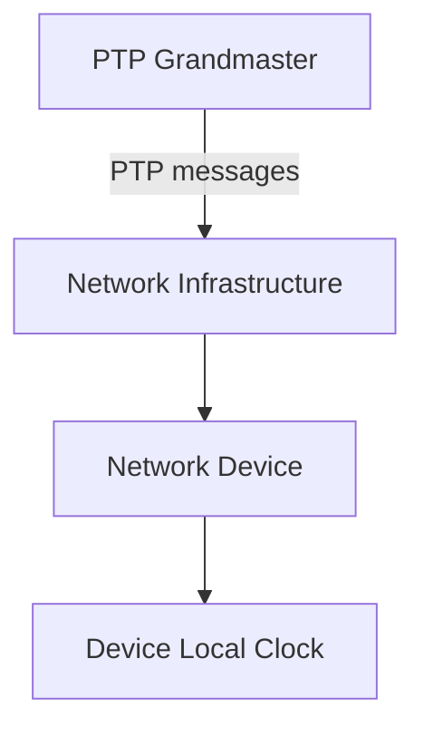
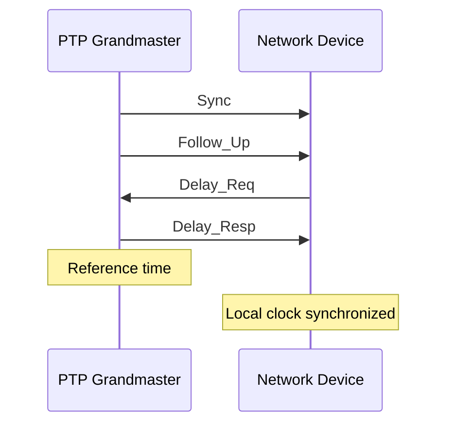
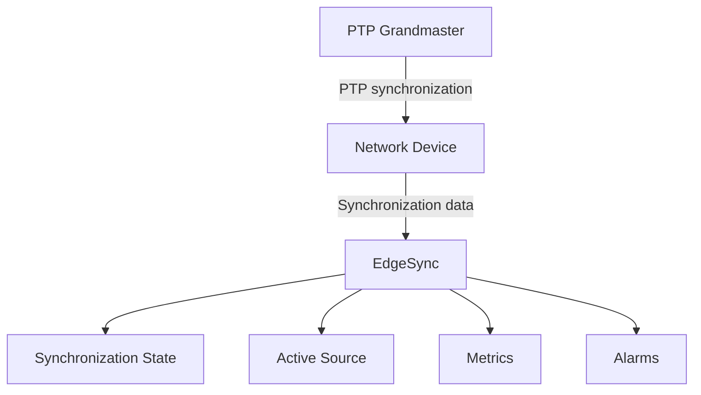

# Precision Time Protocol (PTP)

Precision Time Protocol (PTP) is a network synchronization protocol used to distribute precise time across a network.

In EdgeSync, PTP provides a synchronization mechanism that allows supported network devices to obtain timing from a PTP Grandmaster. EdgeSync monitors the resulting synchronization state, source status, and synchronization metrics.

This document provides a conceptual overview of PTP and explains how EdgeSync uses PTP-related information for monitoring and troubleshooting. It does not describe the complete PTP protocol specification.

## Overview

PTP synchronizes the clocks of network devices with a reference clock over a packet-based network.

A typical PTP deployment includes:

- A PTP Grandmaster that provides the reference time
- Network devices that participate in PTP synchronization
- Network infrastructure that carries PTP messages

A simplified PTP synchronization path is:



The network device uses PTP information to synchronize its local clock with the reference provided by the Grandmaster.

The PTP Grandmaster provides the reference time for the PTP domain.

EdgeSync monitors the synchronization information reported by supported network devices rather than acting as the PTP Grandmaster itself.

## PTP Roles

PTP defines different roles for devices participating in synchronization.

For the monitoring model of EdgeSync, the most important roles are:

| Role               | Description                                                                                |
| ------------------ | ------------------------------------------------------------------------------------------ |
| PTP Grandmaster    | Provides the reference time for the PTP domain.                                            |
| PTP-capable device | Participates in PTP synchronization and adjusts its clock based on the selected reference. |
| Boundary Clock     | Receives PTP timing from an upstream source and provides timing to downstream devices.     |
| Transparent Clock  | Forwards PTP messages while accounting for the time spent traversing the device.           |

The exact PTP roles supported by a network device depend on its implementation and configuration.

EdgeSync does not assume that all monitored devices use the same PTP topology.

## PTP Grandmaster

The PTP Grandmaster provides the reference time used by devices in a PTP domain.

A network may have more than one potential Grandmaster. When multiple candidates are available, the PTP system determines which clock should serve as the Grandmaster according to its clock-selection mechanism.

For EdgeSync, the selected Grandmaster is an important part of the synchronization context because changes in the active reference can affect synchronization state and metrics.

For example:

```text
PTP Grandmaster
     │
     ▼
PTP Network
     │
     ├── Device A
     ├── Device B
     └── Device C
```

EdgeSync can use information reported by monitored devices to identify the synchronization source and investigate synchronization problems.

## PTP Synchronization

PTP uses timestamped messages to allow devices to determine the timing relationship between their local clocks and the reference clock.

A simplified two-step, end-to-end synchronization sequence is shown below:



The exact message exchange depends on the PTP profile and device implementation.

The purpose of the exchange is to provide the receiving device with information needed to estimate the timing relationship between the local clock and the reference clock.

## PTP Domain

A PTP domain is a logical synchronization environment in which PTP clocks participate.

Devices in the same PTP domain can participate in the same synchronization system.

For EdgeSync, the PTP domain can be useful when investigating synchronization problems involving multiple devices.

For example, if several devices in the same PTP domain report synchronization problems at approximately the same time, the problem may be related to a shared synchronization source or network path.

## PTP Profiles

PTP can be used with different profiles that define behavior for specific application environments.

A profile may define or constrain aspects of PTP behavior, such as:

- Message rates
- Transport behavior
- Clock requirements
- Network configuration
- Synchronization performance requirements

EdgeSync should treat the PTP profile as part of the device and network configuration rather than assuming that every PTP deployment uses the same settings.

The configured PTP profile can affect how synchronization behavior and metrics should be interpreted.

## PTP Synchronization Metrics

EdgeSync uses synchronization metrics to help users evaluate the quality of synchronization.

Important metrics include:

### Offset

Offset represents the estimated time difference between the device clock and its synchronization reference.

EdgeSync reports offset in nanoseconds.

For example:

```json
{
  "deviceId": "edge-001",
  "state": "LOCKED",
  "source": "ptp-gm-01",
  "offsetNs": 35
}
```

A smaller offset generally indicates that the device clock is closer to the reference clock.

However, an acceptable offset depends on the device, network, application, and configured synchronization requirements.

### Frequency Offset

Frequency offset represents the difference between the rate of the local clock and the reference.

EdgeSync reports frequency offset in parts per billion (ppb).

For example:

```json
{
  "frequencyOffsetPpb": 0.8
}
```

Frequency offset can help engineers determine whether a device clock is consistently running faster or slower than the reference.

### Jitter

Jitter represents variation in synchronization timing measurements over time.

Higher jitter may indicate increased variation in the timing measurements or instability in the synchronization path.

The exact meaning and calculation of jitter depend on the device implementation and monitoring model.

## PTP and Synchronization State

PTP metrics should be interpreted together with the synchronization state.

For example:

| State      | Possible PTP condition                                                                        |
| ---------- | --------------------------------------------------------------------------------------------- |
| `LOCKED`   | The device is synchronized to an available PTP reference.                                     |
| `HOLDOVER` | The PTP reference is temporarily unavailable, but the device continues using its local clock. |
| `FREERUN`  | No usable external synchronization reference is currently available.                          |
| `FAILED`   | Synchronization requirements are no longer being met.                                         |

These are EdgeSync monitoring states. They do not represent every possible PTP device state.

A device may report `LOCKED` while its offset is increasing, for example. Engineers should therefore review the state, active source, metrics, and alarms together.

## How EdgeSync Monitors PTP

EdgeSync monitors PTP-related information reported by supported network devices.

The monitoring model may include:

- Active PTP source
- PTP source status
- Synchronization state
- Offset
- Frequency offset
- Jitter
- Last update time
- Related alarms

A simplified monitoring flow is:



EdgeSync uses this information to provide a centralized view of synchronization conditions across monitored devices.

## Interpreting PTP Data

When reviewing PTP synchronization data, consider the following information together:

1. **Synchronization state** — Determine whether the device is currently synchronized.
2. **Active source** — Identify which PTP source the device is using.
3. **Offset** — Check the time difference from the reference.
4. **Frequency offset** — Check for sustained clock-rate differences.
5. **Jitter** — Look for variation in synchronization measurements.
6. **Alarms and events** — Check for recent synchronization-related problems.

For example:

```
State: LOCKED
Source: ptp-gm-01
Offset: 35 ns
Frequency offset: 0.8 ppb
```

This indicates that the device is currently synchronized to `ptp-gm-01` and reports a small measured offset.

A single metric should not be used to determine the root cause of a synchronization problem.

## Common PTP Problems

Common PTP-related problems include:

### PTP Grandmaster unavailable

The monitored device cannot use its configured PTP Grandmaster.

Possible areas to investigate include:

- Grandmaster availability
- Network connectivity
- PTP configuration
- Source selection
- Recent alarms and events

### High PTP offset

The device remains synchronized but reports an offset that exceeds the configured requirement.

Possible areas to investigate include:

- Current PTP source
- Network path
- PTP configuration
- Offset trend
- Related alarms

### PTP synchronization lost

The device is no longer synchronized to a usable PTP reference.

Possible areas to investigate include:

- Synchronization state
- Active source
- Source availability
- PTP configuration
- Network connectivity
- Recent events

The exact cause depends on the device, network topology, and PTP configuration.

## Troubleshooting PTP Synchronization

When investigating a PTP synchronization problem, use the following workflow:

```text
PTP problem
   ↓
Check state and active source
   ↓
Review metrics
   ↓
Check alarms
   ↓
Follow troubleshooting workflow
```

Start with the synchronization state and active source before investigating individual metrics.

For a general troubleshooting workflow, see the troubleshooting documentation.

## Related Documentation

- [Network Synchronization](network-synchronization.md)
- [Synchronization States](synchronization-states.md)
- [Synchronization Sources](synchronization-sources.md)
- [NTP](ntp.md)
- [High PTP Offset](../troubleshooting/high-ptp-offset.md)
- [Synchronization Lost](../troubleshooting/synchronization-lost.md)
