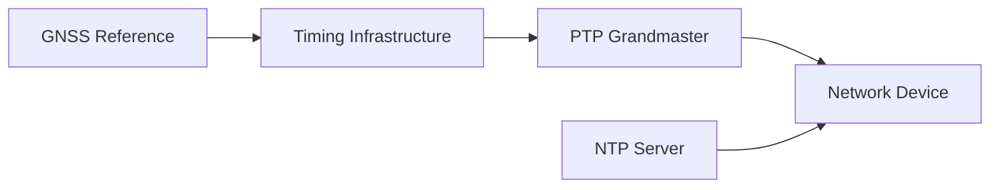
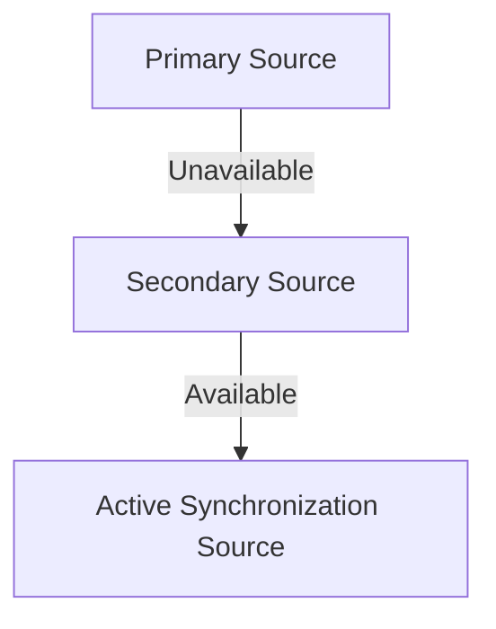
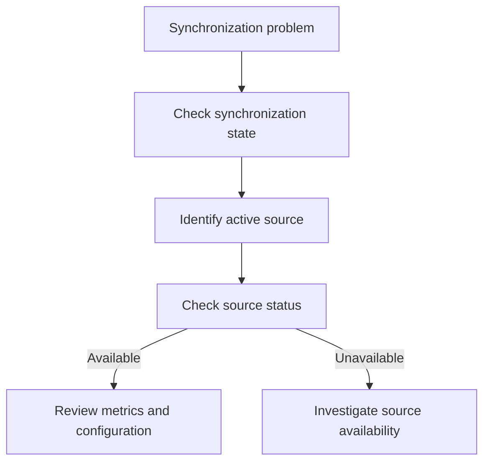

# Synchronization Sources

Synchronization sources provide the timing references used by network devices to maintain accurate and consistent time.

EdgeSync monitors the synchronization sources configured for each device and reports source availability, status, and the currently active source.

This document describes the synchronization source concepts used by EdgeSync. It does not describe detailed PTP or NTP protocol behavior.

## Overview

A network device may use one or more synchronization sources.

EdgeSync monitors network synchronization sources and associated timing references configured for the synchronization infrastructure.

EdgeSync supports the following network synchronization source types:

| Source type | Description | Typical use |
|---|---|---|
| PTP Grandmaster | Provides precise timing to network devices using Precision Time Protocol (PTP). | High-precision network synchronization |
| NTP Server | Provides time synchronization using Network Time Protocol (NTP). | General-purpose time synchronization |

A synchronization infrastructure may also use a GNSS reference to provide a highly accurate timing reference to a clock or synchronization device.

A device may have multiple configured synchronization sources. EdgeSync monitors these sources and identifies which source is currently active.

## Source Types

### PTP Grandmaster

A PTP Grandmaster provides a highly accurate time reference to devices in a PTP-enabled network.

PTP is commonly used when network devices require more precise synchronization than traditional NTP-based synchronization can provide.

In EdgeSync, a PTP Grandmaster can be configured as a synchronization source for a monitored device.

EdgeSync can monitor information such as:

- Source availability
- Source status
- Active source
- Synchronization state
- Offset from the reference
- Related alarms

For detailed information about PTP, see [PTP](ptp.md).

### NTP Server

An NTP Server provides time synchronization using the Network Time Protocol (NTP).

NTP is widely used for general-purpose network time synchronization and can be used when the application's timing requirements do not require the precision provided by PTP.

In EdgeSync, an NTP server can be configured as a synchronization source and monitored for availability and synchronization status.

For detailed information about NTP, see [NTP](ntp.md).

### GNSS Reference

A GNSS reference provides timing information derived from satellite-based positioning systems.

GNSS can provide a highly accurate timing reference for synchronization infrastructure. In a network environment, a GNSS reference may provide timing information to a clock or synchronization device, which then provides timing to other network devices.

In EdgeSync, GNSS is treated as a timing reference associated with the synchronization infrastructure rather than as a network synchronization protocol.

## Synchronization Source Model

Synchronization sources and timing references may play different roles in a network synchronization infrastructure.



In this model, a GNSS reference provides timing to synchronization infrastructure, while a PTP Grandmaster or NTP Server provides synchronization to a network device.

## Active Synchronization Source

The active synchronization source is the source currently being used by a device for synchronization.

For example, a device may have the following sources configured:

| Source | Type | Status |
|---|---|---|
| `ptp-gm-01` | PTP Grandmaster | Available |
| `ptp-gm-02` | PTP Grandmaster | Available |
| `ntp-01` | NTP Server | Available |

The device may currently use `ptp-gm-01` as its active source.

EdgeSync reports the active source as part of the synchronization status.

Example:

```json
{
  "deviceId": "edge-001",
  "state": "LOCKED",
  "source": "ptp-gm-01",
  "offsetNs": 35,
  "frequencyOffsetPpb": 0.8,
  "lastUpdated": "2026-09-08T08:30:00Z"
}
```

In this example, `ptp-gm-01` is the active synchronization source.

## Primary and Secondary Sources

A device may be configured with multiple synchronization sources to improve synchronization availability.

A typical configuration may include:

- A primary source
- One or more secondary sources

If the primary source becomes unavailable, the device may select another available source according to its configured source-selection rules.

For example, a device may fail over from a primary PTP Grandmaster to a secondary PTP Grandmaster:



The exact source-selection behavior depends on the device and its configuration.

EdgeSync monitors the resulting source selection but does not assume that all devices use the same selection algorithm.

## Source Status

EdgeSync uses source status to indicate whether a configured synchronization source is available for use.

Typical source conditions include:

| Status        | Description                                          |
| ------------- | ---------------------------------------------------- |
| `AVAILABLE`   | The source is available for synchronization.         |
| `UNAVAILABLE` | The source cannot currently be used.                 |
| `UNKNOWN`     | EdgeSync cannot determine the current source status. |

Source status should be interpreted together with the synchronization state and related alarms.

For example, an `AVAILABLE` source does not necessarily mean that the device is currently synchronized to that source.

## Source Selection

When multiple synchronization sources are configured, the device may select one source as the active source.

Source selection may depend on factors such as:

- Source availability
- Source priority
- Device configuration
- Synchronization protocol

EdgeSync reports the source selected by the monitored device.

The source selection process is device-dependent. EdgeSync does not assume a universal selection algorithm.

## Monitoring Synchronization Sources

EdgeSync monitors synchronization sources as part of its synchronization monitoring model.

The monitoring information may include:

- Source ID
- Source type
- Source status
- Priority
- Active/inactive state
- Last update time
- Related alarms

This information helps network engineers determine whether a synchronization problem is related to the active synchronization source or its availability.

For example:



## Example Synchronization Source

The following example shows a synchronization source returned by the EdgeSync API:

```json
{
  "id": "ptp-gm-01",
  "name": "Primary PTP Grandmaster",
  "type": "PTP",
  "status": "AVAILABLE",
  "priority": 1
}
```

The `priority` value represents the configured source priority. The exact meaning of priority depends on the source-selection behavior supported by the monitored device.

## Troubleshooting Source Problems

A synchronization source problem may cause a device to enter a degraded synchronization state.

Common source-related problems include:

### Source unavailable

If the active source becomes unavailable:

1. Check the source status.
2. Check recent alarms and events.
3. Verify network connectivity to the source.
4. Check the source configuration.
5. Determine whether a secondary source is available.
6. Review the device synchronization state and metrics.

### Unexpected active source

If the device is using an unexpected synchronization source:

1. Identify the current active source.
2. Review the configured source priorities.
3. Check the availability of higher-priority sources.
4. Review recent source-selection events.
5. Verify the device configuration.

## Related Documentation
- [Network Synchronization](network-synchronization.md)
- [Synchronization States](synchronization-states.md)
- [PTP](ptp.md)
- [NTP](ntp.md)
- [Configure a Synchronization Source](../administrator/configure-source.md)
- [Synchronization Source Unavailable](../troubleshooting/source-unavailable.md)
