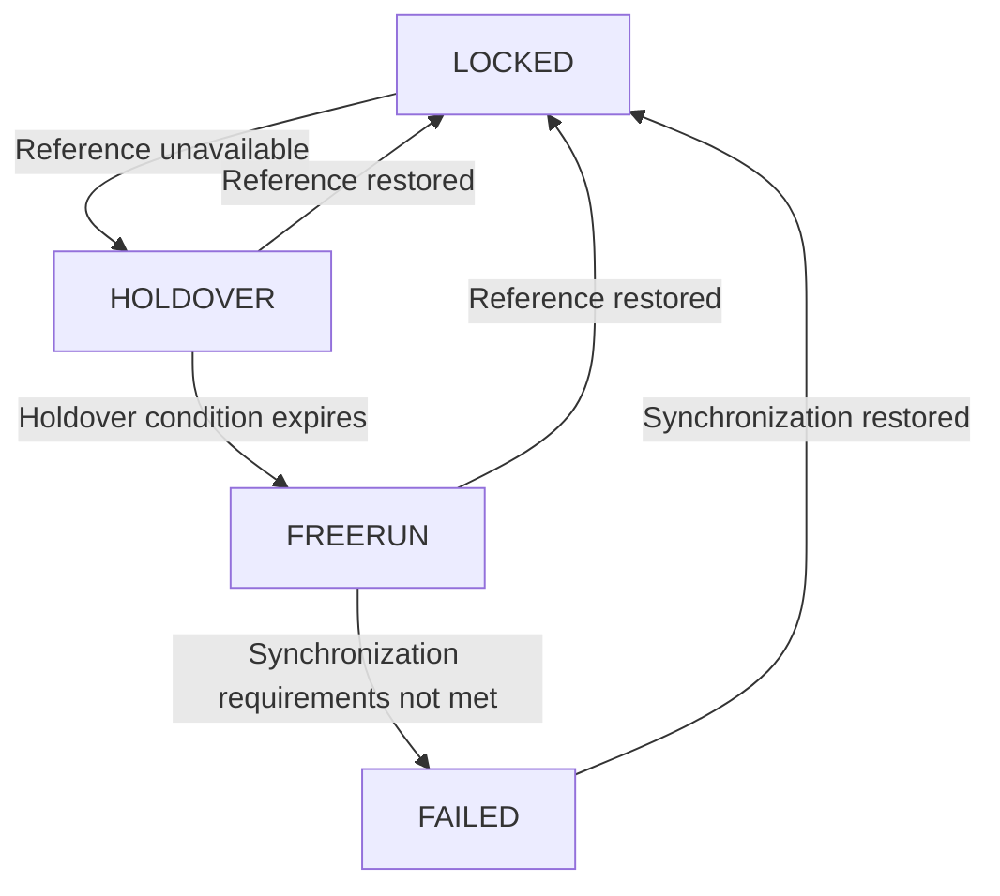
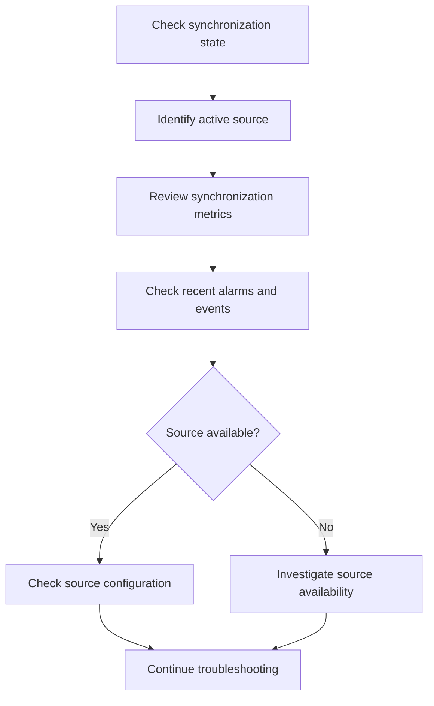

# Synchronization States

EdgeSync uses synchronization states to represent the current synchronization condition of a monitored network device.

Synchronization state provides a high-level view of whether a device is synchronized to an available reference source and whether the device is meeting its configured synchronization requirements.

## Overview

EdgeSync defines four synchronization states:

| State | Description | Typical condition |
|---|---|---|
| `LOCKED` | The device is synchronized to an available reference source. | Synchronization is operating normally. |
| `HOLDOVER` | The device has temporarily lost its reference source but is maintaining timing using its local clock. | The reference source is unavailable or communication with the source has been interrupted. |
| `FREERUN` | The device is operating without an active external synchronization reference. | No usable synchronization reference is currently available. |
| `FAILED` | EdgeSync determines that the device is no longer meeting the configured synchronization requirements. | Synchronization has degraded beyond the configured requirements. |

These states are EdgeSync monitoring states. The exact synchronization states reported by an underlying network device may vary by device implementation.

The state should be interpreted together with the active synchronization source, synchronization metrics, and related alarms.

## State Model

The following diagram shows a simplified synchronization state model:



This model represents a simplified monitoring workflow. Actual state transitions may depend on device behavior, source availability, configured thresholds, and deployment-specific requirements.

## LOCKED

`LOCKED` indicates that the device is synchronized to an available reference source.

The device has an active synchronization reference and is currently meeting the synchronization conditions defined for the EdgeSync deployment.

### What users may see

A device in the `LOCKED` state may show:

- An active synchronization source
- A current synchronization timestamp
- A measured clock offset
- A measured frequency offset
- Current jitter information
- No active synchronization-loss alarm

Example:

```JSON
{
  "deviceId": "edge-001",
  "state": "LOCKED",
  "source": "ptp-gm-01",
  "offsetNs": 35,
  "frequencyOffsetPpb": 0.8,
  "jitterNs": 12,
  "lastUpdated": "2026-09-08T08:30:00Z"
}
```

### How to interpret `LOCKED`

`LOCKED` indicates the current synchronization state is normal according to the EdgeSync monitoring model.

However, `LOCKED` does not necessarily mean that every synchronization metric is optimal.

For example, an increasing offset may indicate that synchronization is degrading even if the device remains in the `LOCKED` state.

When investigating a potential issue, review the synchronization metrics and recent alarms together with the current state.

## HOLDOVER

`HOLDOVER` indicates that the device has temporarily lost its reference source but is maintaining timing using its local clock.

A device may enter `HOLDOVER` when its synchronization source becomes unavailable or communication with the source is interrupted.

During holdover, the device attempts to maintain timing without receiving current timing information from its external reference.

### What users may see

A device in the `HOLDOVER` state may show:

- No currently usable synchronization source
- A previous synchronization source
- Increasing frequency or phase error
- A synchronization-source alarm
- A recent source-loss event

Example:

```JSON
{
  "deviceId": "edge-001",
  "state": "HOLDOVER",
  "source": "ptp-gm-01",
  "offsetNs": 180,
  "frequencyOffsetPpb": 2.4,
  "jitterNs": 25,
  "lastUpdated": "2026-09-08T08:35:00Z"
}
```

### How to interpret `HOLDOVER`

`HOLDOVER` should generally be treated as a degraded synchronization condition.

The device may continue operating normally for some period of time, but synchronization accuracy may deteriorate as the holdover period increases.

When a device enters `HOLDOVER`:

1. Check whether the configured synchronization source is available.
2. Check recent synchronization-source alarms.
3. Check the device's synchronization metrics.
4. Verify the network path between the device and its reference source.
5. Follow the appropriate troubleshooting procedure.

See [Synchronization Source Unavailable](../troubleshooting/source-unavailable.md) for troubleshooting guidance.

## FREERUN

`FREERUN` indicates that the device is operating without an active external synchronization reference.

In this condition, the device relies on its local clock rather than an external synchronization source.

### What users may see

A device in the `FREERUN` state may show:

- No active synchronization source
- Increasing clock offset
- Frequency drift
- Synchronization-related alarms
- A prolonged period without a valid synchronization reference

Example:

```JSON
{
  "deviceId": "edge-001",
  "state": "FREERUN",
  "source": null,
  "offsetNs": 850,
  "frequencyOffsetPpb": 5.2,
  "jitterNs": 60,
  "lastUpdated": "2026-09-08T08:42:00Z"
}
```

### How to interpret `FREERUN`

`FREERUN` indicates that no usable external synchronization reference is currently available.

The device may continue to operate, but its clock can gradually diverge from the expected reference time.

When a device enters `FREERUN`:

1. Check whether a synchronization source is configured.
2. Check whether the configured source is reachable.
3. Check recent source-loss events and alarms.
4. Verify PTP or NTP configuration as applicable.
5. Check whether an alternative synchronization source is available.

## FAILED

`FAILED` indicates that EdgeSync determines that the device is no longer meeting the configured synchronization requirements.

This state represents a significant synchronization problem that requires investigation.

### What users may see

A device in the `FAILED` state may show:

- Synchronization metrics outside configured requirements
- A synchronization failure alarm
- No usable synchronization source
- Persistent synchronization degradation
- A recent synchronization-related event

Example:

```JSON
{
  "deviceId": "edge-001",
  "state": "FAILED",
  "source": null,
  "offsetNs": 4200,
  "frequencyOffsetPpb": 18.5,
  "jitterNs": 180,
  "lastUpdated": "2026-09-08T08:50:00Z"
}
```

### How to interpret `FAILED`

`FAILED` indicates that the current synchronization condition does not satisfy the configured requirements.

The state does not identify the root cause by itself.

Possible causes include:

- Synchronization source failure
- Network connectivity problems
- Incorrect PTP or NTP configuration
- Excessive packet delay or packet loss
- Device clock or timing subsystem problems
- Synchronization metrics exceeding configured thresholds

When a device enters `FAILED`:

1. Check the active alarms.
2. Check the current and historical synchronization metrics.
3. Identify the last known synchronization source.
4. Verify source availability.
5. Check the network path.
6. Review the relevant device configuration.
7. Follow the appropriate troubleshooting procedure.

See [Troubleshooting](../troubleshooting/index.md) for additional guidance.

## Monitoring State vs. Root Cause

A synchronization state describes **what is happening**, but it does not necessarily explain **why it is happening**.

For example:

```
State: HOLDOVER
        |
        +-- Possible cause: PTP Grandmaster unavailable
        |
        +-- Possible cause: Network connectivity problem
        |
        +-- Possible cause: PTP configuration error
        |
        +-- Possible cause: Timing source failure
```

Therefore, troubleshooting should not stop at the state.

Use the following information together:

- Synchronization state
- Active synchronization source
- Synchronization metrics
- Recent events
- Active alarms
- Device configuration

This information helps engineers narrow down the possible root cause.

## State and Synchronization Metrics

Synchronization state should be interpreted together with synchronization metrics.

| State      | Metrics to check                                   | Why                                                         |
| ---------- | -------------------------------------------------- | ----------------------------------------------------------- |
| `LOCKED`   | Offset, frequency offset, jitter                   | Detect early signs of degradation.                          |
| `HOLDOVER` | Offset, frequency offset, elapsed holdover time    | Determine whether synchronization quality is deteriorating. |
| `FREERUN`  | Offset, frequency offset                           | Understand clock drift without an external reference.       |
| `FAILED`   | Offset, frequency offset, jitter, last update time | Determine the severity and possible cause of the failure.   |

A single metric should not normally be used to determine the root cause of a synchronization problem.

## State and Alarms

EdgeSync can generate synchronization-related alarms when monitored conditions meet configured alarm rules.

For example:

```
Synchronization Source Unavailable
              |
              ▼
          HOLDOVER
              |
              ▼
      Synchronization degrades
              |
              ▼
           FREERUN
              |
              ▼
       Requirements not met
              |
              ▼
           FAILED
```

The state and alarm provide complementary information:

- **State** describes the current synchronization condition.
- **Alarm** indicates that a monitored condition requires attention.

For example, a device may be in `HOLDOVER` while an `SYNC_SOURCE_UNAVAILABLE` alarm is active.

## Recommended Investigation Workflow

When investigating a synchronization issue, use the following workflow:



This workflow provides a general investigation path. The appropriate troubleshooting procedure depends on the observed state and the underlying synchronization problem.

## Related Documentation

- [Network Synchronization](network-synchronization.md)
- [Synchronization Sources](synchronization-sources.md)
- [PTP](ptp.md)
- [NTP](ntp.md)
- [Monitoring Model](monitoring-model.md)
- [Synchronization Source Unavailable](../troubleshooting/source-unavailable.md)
- [PTP Offset Too High](../troubleshooting/high-ptp-offset.md)
- [Synchronization Lost](../troubleshooting/synchronization-lost.md)
