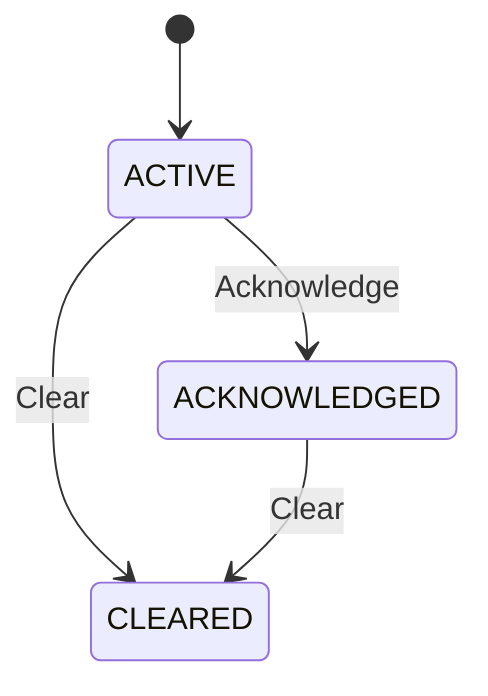

# EdgeSync Alarm Model

**Status:** Proposed MVP Design  
**Version:** 1.0

## 1. Purpose

This document defines the conceptual data model for an alarm in EdgeSync.

An alarm represents a monitored condition that requires attention. It is distinct from a Synchronization State and an Event.

> **Design note:** Alarm lifecycle and field semantics are not fully defined by the current product requirements. This document records the proposed MVP model so that the API contract can be reviewed and evolved consistently.

## 2. Scope and boundaries

This model covers:

- Alarm identity
- Affected device
- Related synchronization source
- Alarm code and message
- Severity
- Lifecycle status
- Alarm timestamps

This model does not define:

- The complete set of alarm rules
- Universal severity assignment rules
- Device-specific alarm thresholds
- Root-cause diagnosis procedures
- Event schema
- Database schema

## 3. Alarm Model

A typical alarm record is:

```json
{
  "alarmId": "alarm-1001",
  "deviceId": "edge-001",
  "sourceId": "ptp-gm-01",
  "code": "SYNC_SOURCE_UNAVAILABLE",
  "severity": "MAJOR",
  "status": "ACTIVE",
  "message": "The configured synchronization source is unavailable.",
  "createdAt": "2026-09-08T08:25:00Z",
  "updatedAt": "2026-09-08T08:25:00Z",
  "acknowledgedAt": null,
  "clearedAt": null
}
```

## 4. Fields

| Field | Type | Required | Meaning |
|---|---|---:|---|
| `alarmId` | string | Yes | Unique identifier of this alarm instance. |
| `deviceId` | string | Yes | Identifier of the affected network device. |
| `sourceId` | string or null | No | Identifier of the related synchronization source, when the alarm is source-related. |
| `code` | string | Yes | Stable machine-readable identifier for the alarm condition. |
| `severity` | enum | Yes | Proposed severity classification for the alarm. |
| `status` | enum | Yes | Current lifecycle status of the alarm. |
| `message` | string | Yes | Human-readable description of the alarm condition. |
| `createdAt` | date-time | Yes | Time when the alarm instance was created. |
| `updatedAt` | date-time | Yes | Time when the alarm resource was most recently updated. |
| `acknowledgedAt` | date-time or null | No | Time when a user acknowledged the alarm. |
| `clearedAt` | date-time or null | No | Time when the alarm condition was cleared. |

## 5. Alarm Identity

`alarmId` identifies a specific alarm instance.

The same alarm code may occur multiple times for the same device.

For example:

```text
alarm-1001  SYNC_SOURCE_UNAVAILABLE  CLEARED
alarm-1045  SYNC_SOURCE_UNAVAILABLE  ACTIVE
```

These are separate alarm instances.

## 6. Device Relationship

`deviceId` identifies the network device affected by the alarm.

Conceptually:

```text
Device
  │
  └── 1 : N
       │
       ▼
     Alarm
```

A device may have multiple active or historical alarms.

## 7. Synchronization Source Relationship

`sourceId` optionally identifies the synchronization source associated with an alarm.

For example:

```text
Device:  edge-001
Source:  ptp-gm-01
Alarm:   SYNC_SOURCE_UNAVAILABLE
```

The Alarm resource references the source by ID rather than embedding the complete Synchronization Source object.

## 8. Alarm Code

`code` is a stable machine-readable identifier.

The initial proposed MVP codes are:

| Code | Meaning |
|---|---|
| `SYNC_SOURCE_UNAVAILABLE` | A configured synchronization source is unavailable. |
| `HIGH_PTP_OFFSET` | A monitored PTP offset meets the configured alarm condition. |
| `SYNCHRONIZATION_LOST` | Synchronization has been lost according to the configured alarm rule. |
| `SYNCHRONIZATION_FAILURE` | EdgeSync determines that a synchronization failure condition requires attention. |

These codes are proposed MVP values. The canonical list should eventually be maintained in a dedicated alarm-code reference if the alarm taxonomy grows.

## 9. Severity

The proposed MVP severity levels are:

```text
CRITICAL
MAJOR
MINOR
WARNING
```

Severity classification is a design assumption at this stage. The current product requirements do not define universal rules for assigning a severity to every alarm.

## 10. Alarm Status and Lifecycle

The proposed MVP lifecycle uses three statuses:

```text
ACTIVE
ACKNOWLEDGED
CLEARED
```

### ACTIVE

The alarm condition is currently active and has not been acknowledged.

### ACKNOWLEDGED

A user has acknowledged the alarm, but the underlying alarm condition may still exist.

Acknowledging an alarm does not mean that the condition has been resolved.

### CLEARED

The alarm condition is no longer active and the alarm lifecycle has ended.

## 11. Lifecycle Model



This is the proposed MVP lifecycle. The current product requirements establish acknowledge and clear operations, but do not yet specify all transition rules.

## 12. Timestamp Semantics

The proposed timestamp model is:

```text
createdAt
updatedAt
acknowledgedAt
clearedAt
```

For an alarm that has not been acknowledged or cleared:

```json
{
  "acknowledgedAt": null,
  "clearedAt": null
}
```

## 13. Alarm vs Synchronization State vs Event

These concepts must remain separate.

| Concept | Main question |
|---|---|
| Synchronization State | What is the current synchronization condition? |
| Event | What notable occurrence happened? |
| Alarm | What condition requires attention? |

For example:

```text
Synchronization State: HOLDOVER
Alarm: SYNC_SOURCE_UNAVAILABLE
```

The state describes the current synchronization condition. The alarm identifies a condition that requires attention.

## 14. Relationship to Monitoring Data

Alarms should be interpreted together with:

- Synchronization State
- Active Synchronization Source
- Source Status
- Synchronization Metrics
- Last Update Time
- Recent Events
- Device configuration

No single alarm or monitoring value should normally be treated as sufficient to determine root cause.

## 15. API Representation

The REST API represents alarms using the `Alarm` schema.

Alarm operations include:

```text
GET  /api/v1/alarms
GET  /api/v1/alarms/{alarmId}
POST /api/v1/alarms/{alarmId}/acknowledge
POST /api/v1/alarms/{alarmId}/clear
```

The API contract is defined in `openapi/edgesync.yaml`.

## 16. Design Decisions

### 16.1 Use `sourceId` rather than an embedded source object

An alarm may be related to a synchronization source, but the source remains a separate resource.

### 16.2 Keep alarm status separate from synchronization state

`ACTIVE`, `ACKNOWLEDGED`, and `CLEARED` describe the alarm lifecycle.

They must not be confused with `LOCKED`, `HOLDOVER`, `FREERUN`, and `FAILED`, which describe synchronization state.

### 16.3 Keep severity as an explicit field

Severity is separated from the alarm code because different alarm conditions may require different operational classifications.

The initial severity taxonomy remains a proposed design.

### 16.4 Keep lifecycle timestamps nullable

`acknowledgedAt` is null until acknowledgement occurs.

`clearedAt` is null until the alarm is cleared.

## 17. Related Documentation

- [Monitoring Data Model](monitoring-data-model.md)
- [Synchronization States](../concepts/synchronization-states.md)
- [Synchronization Sources](../concepts/synchronization-sources.md)
- [Troubleshooting](../troubleshooting/index.md)
- [API Reference](../api-reference/index.md)
