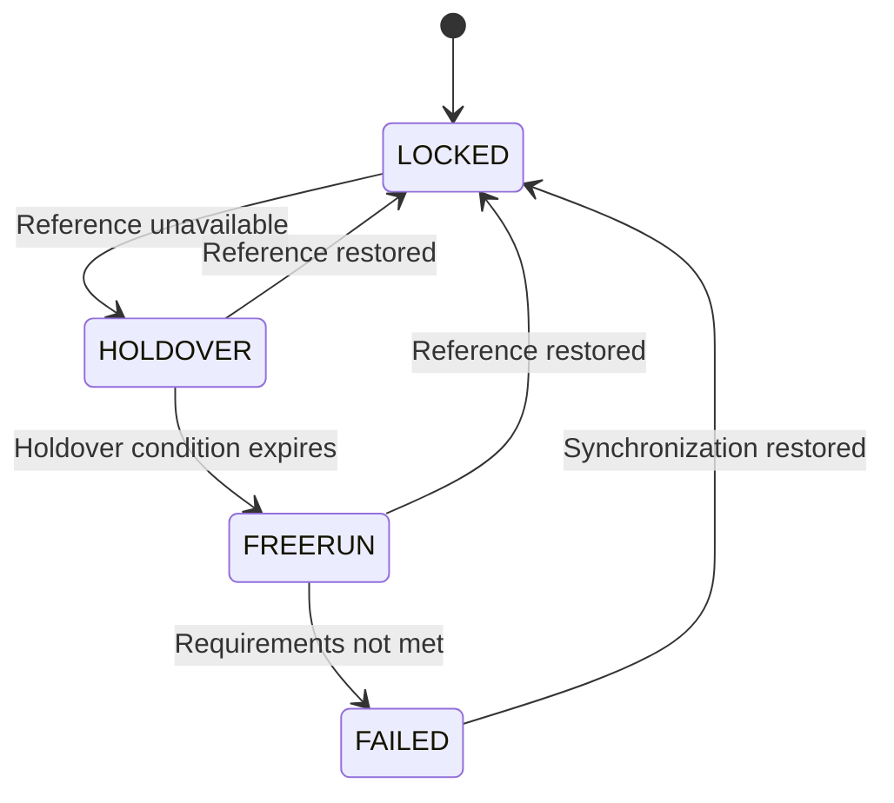
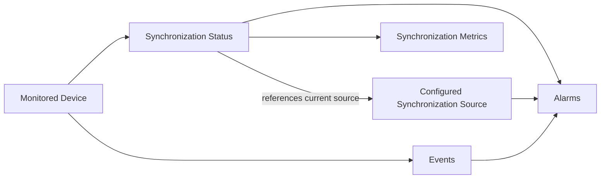

# EdgeSync Monitoring Data Model

**Status:** Draft  
**Version:** 1.0

## 1. Purpose

This document defines the common semantics EdgeSync uses to represent the synchronization condition of monitored network devices.

It separates synchronization state, active synchronization source, source status, synchronization metrics, last update time, events, and alarms.

> **Source of truth:** This document defines what monitoring data means. `openapi/edgesync.yaml` defines how that data is represented by the REST API.

## 2. Scope and boundaries

This model covers the common monitoring concepts and their relationships across supported synchronization mechanisms such as PTP and NTP.

It does not define detailed PTP/NTP behavior, device-specific clock algorithms, universal thresholds, complete alarm lifecycle rules, REST endpoints, or the database schema.

## 3. Core model

```text
Monitored Device
       |
       +-- Synchronization Status
       |      +-- Synchronization State
       |      +-- Active Synchronization Source
       |      +-- Offset
       |      +-- Frequency Offset
       |      +-- Jitter
       |      +-- Last Update Time
       |
       +-- Configured Synchronization Sources
       |      +-- Source ID
       |      +-- Type
       |      +-- Status
       |      +-- Priority
       |
       +-- Events
       +-- Alarms
```

The Synchronization Status Record and Synchronization Source Resource are separate. Status references the current active source by ID; it does not embed the complete source object.

## 4. Synchronization Status Record

A Synchronization Status Record represents the current synchronization information available for one monitored device.

```json
{
  "deviceId": "edge-001",
  "state": "LOCKED",
  "source": "ptp-gm-01",
  "offsetNs": 35,
  "frequencyOffsetPpb": 0.8,
  "jitterNs": 12,
  "lastUpdated": "2026-09-08T08:30:00Z"
}
```

| Field | Type | Required | Meaning |
|---|---|---:|---|
| `deviceId` | string | Yes | Identifier of the monitored network device. |
| `state` | enum | Yes | Current EdgeSync synchronization state. |
| `source` | string or null | Yes | ID of the current active synchronization source; `null` when none is available. |
| `offsetNs` | integer or null | No | Estimated clock offset from the synchronization reference, in ns. |
| `frequencyOffsetPpb` | number or null | No | Difference between local clock rate and reference, in ppb. |
| `jitterNs` | integer or null | No | Variation in synchronization timing measurements, in ns. |
| `lastUpdated` | date-time | Yes | Time when synchronization information was most recently updated. |

Metric availability depends on the device implementation and supported monitoring interface.

## 5. Synchronization State

EdgeSync defines four canonical monitoring states:

| State | Meaning |
|---|---|
| `LOCKED` | Device is synchronized to an available reference source and is meeting deployment synchronization conditions. |
| `HOLDOVER` | Device temporarily lost its usable reference but maintains timing using its local clock. |
| `FREERUN` | Device operates without an active external synchronization reference. |
| `FAILED` | EdgeSync determines that the device no longer meets configured synchronization requirements. |

These are EdgeSync monitoring states; they do not necessarily correspond directly to every state reported by an underlying device.

### State model



Actual transitions depend on device behavior, source availability, configured thresholds, and deployment requirements.

A state describes **what is happening**, not necessarily **why it is happening**.

## 6. Active Synchronization Source

The Active Synchronization Source is the source currently selected or used by the monitored network device.

Examples include a PTP Grandmaster and an NTP Server.

The API `source` field represents the current active source only. It must not represent a previously used source, a merely configured source, or an available-but-inactive source.

If no active source is available:

```json
{
  "deviceId": "edge-001",
  "state": "FREERUN",
  "source": null
}
```

A device may have multiple configured sources while only one is active:

```text
Configured Sources
+-- ptp-gm-01
+-- ptp-gm-02
+-- ntp-01

Active Synchronization Source
+-- ptp-gm-01
```

Primary and Secondary describe source priority/configuration, not PTP/NTP protocol roles.

## 7. Source Status

Source Status describes whether a configured synchronization source can currently be used.

| Status | Meaning |
|---|---|
| `AVAILABLE` | Source is available for synchronization. |
| `UNAVAILABLE` | Source cannot currently be used. |
| `UNKNOWN` | EdgeSync cannot determine current source status. |

Source Status and Synchronization State are different dimensions. For example, `AVAILABLE` and `HOLDOVER` can coexist because an available source is not necessarily the source currently used by the device.

## 8. Synchronization Source Resource

For the MVP API, network synchronization source types are:

| API type | Represents |
|---|---|
| `PTP` | PTP Grandmaster |
| `NTP` | NTP Server |

Example:

```json
{
  "id": "ptp-gm-01",
  "name": "Primary PTP Grandmaster",
  "type": "PTP",
  "status": "AVAILABLE",
  "priority": 1
}
```

| Field | Type | Required | Meaning |
|---|---|---:|---|
| `id` | string | Yes | Unique source identifier. |
| `name` | string | Yes | Human-readable source name. |
| `type` | enum | Yes | `PTP` or `NTP`. |
| `status` | enum | Yes | `AVAILABLE`, `UNAVAILABLE`, or `UNKNOWN`. |
| `priority` | integer | Yes | Configured source priority. |

> GNSS is treated as a timing reference within synchronization infrastructure, not as an MVP network synchronization source type.

## 9. Synchronization Metrics

### Offset

`offsetNs` is the estimated time difference between the device clock and its synchronization reference. Unit: nanoseconds.

No universal acceptable threshold should be assumed; requirements depend on the device, network, application, and configuration.

### Frequency Offset

`frequencyOffsetPpb` is the difference between the local clock rate and the reference. Unit: parts per billion.

### Jitter

`jitterNs` represents variation in synchronization timing measurements over time. Its exact meaning and calculation depend on the device implementation and monitoring model.

## 10. Last Update Time

`lastUpdated` identifies when synchronization information was most recently updated. The API uses an ISO 8601 date-time.

## 11. Events and alarms

| Concept | Answers |
|---|---|
| Synchronization State | What is the device's current synchronization condition? |
| Source Status | Can a configured source currently be used? |
| Event | What happened in the monitored environment? |
| Alarm | What monitored condition currently requires attention? |

A typical investigation considers state, active source, source status, metrics, last update time, recent events, and active alarms together.

Detailed alarm lifecycle behavior belongs in alarm documentation and API Reference.

## 12. Relationship model



## 13. API mapping

| Monitoring concept | API field |
|---|---|
| Monitored device | `deviceId` |
| Synchronization State | `state` |
| Active Synchronization Source | `source` |
| Offset | `offsetNs` |
| Frequency Offset | `frequencyOffsetPpb` |
| Jitter | `jitterNs` |
| Last Update Time | `lastUpdated` |

These names should remain consistent across OpenAPI, API Reference, and Developer Guide.

## 14. Design principles

1. Separate state from cause.
2. Separate active source from configured sources.
3. Separate source status from synchronization state.
4. Keep metrics nullable because devices may not expose every metric.
5. Avoid universal thresholds.
6. Keep conceptual semantics separate from API representation.
7. Let PTP and NTP documents own protocol-specific behavior.

## 15. Related documentation

- [Network Synchronization](../concepts/network-synchronization.md)
- [Synchronization States](../concepts/synchronization-states.md)
- [Synchronization Sources](../concepts/synchronization-sources.md)
- [PTP](../concepts/ptp.md)
- [NTP](../concepts/ntp.md)
- [API Reference](../api-reference/index.md)
